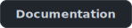
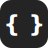

 
 

I like building software that’s fun to engineer — developer tools, networking software, backend systems, terminal apps, and AI tooling.

Mostly **C++** and **golang**, **python** too, while still learning **java**.

 

## Projects

<table>
<tr>
<td width="50%" valign="top">

### slick-code

an agentic coding ai built for terminal

&nbsp;

</td>
<td width="50%" valign="top">

### network-proxy

an experimental networking framework built just for fun honestly, but it is absolutely good

&nbsp;

</td>
</tr>
</table>

 

## Languages & Tools

Languages

Tools

 

## Currently Building

- `slick-code` 
- experimental networking software
- small tools  i need myself

 

## GitHub Activity

&nbsp;

 

---

Vs code (mostly) · Ghostty · linux (beloved) — most things i build are fun to build.
